# Terraform Erste Schritte

Dieses Projekt demonstriert den vollständigen Terraform-Workflow mit Variablen, Outputs und Infrastructure as Code Best Practices. Das Ziel ist es, eine flexible Terraform-Konfiguration zu erstellen, die einen Docker-Container mit anpassbarem Inhalt deployt.

## Projektstruktur

Das Projekt ist folgendermaßen organisiert:

```
terraform-first-steps/
├── .terraform/                    # Terraform Provider-Plugins (automatisch generiert)
├── screenshots/                   # Screenshots des Terraform-Workflows
│   ├── 01-terraform-apply-default1.png    # Apply Default - Plan
│   ├── 01-terraform-apply-default2.png    # Apply Default - Ausführung
│   ├── 01-terraform-apply-default3.png    # Apply Default - Outputs
│   ├── 02-browser-default-content.png     # Browser mit Default-Inhalt
│   ├── 03-terraform-plan-tfvars1.png      # Plan mit tfvars
│   ├── 03-terraform-plan-tfvars2.png      # Plan mit tfvars (Fortsetzung)
│   ├── 04-browser-tfvars-content.png      # Browser mit tfvars-Inhalt
│   ├── 05-terraform-apply-cli-var1.png    # Apply mit CLI-Variablen
│   ├── 05-terraform-apply-cli-var2.png    # Apply mit CLI-Variablen (Fortsetzung)
│   ├── 05-terraform-apply-cli-var3.png    # Apply mit CLI-Variablen (Outputs)
│   ├── 06-terraform-outputs.png           # Terraform Outputs anzeigen
│   ├── 07-terraform-destroy.png           # Terraform Destroy
│   ├── terraform-init.png                 # Initiale Terraform Init
│   └── terraform-plan.png                 # Initialer Terraform Plan
├── .terraform.lock.hcl           # Terraform Dependency Lock File
├── main.tf                       # Hauptkonfiguration mit Docker-Ressourcen
├── provider.tf                   # Provider-Konfiguration
├── variables.tf                  # Input-Variablen-Definitionen
├── outputs.tf                    # Output-Definitionen
├── test.tfvars                   # Beispiel-Variablenwerte
├── locals.tf                     # Lokale Werte (optional)
├── .gitignore                    # Git-Ignore-Datei
└── README.md                     # Dokumentation
```

## Terraform Workflow Demonstration

### Phase 1: Grundlegende Konfiguration

#### 1.1 Terraform Initialisierung

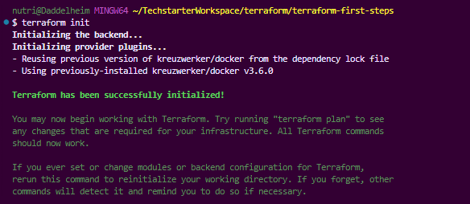

**Was passiert**: `terraform init` lädt die erforderlichen Provider-Plugins herunter und initialisiert das Arbeitsverzeichnis.

#### 1.2 Terraform Plan (Initial)

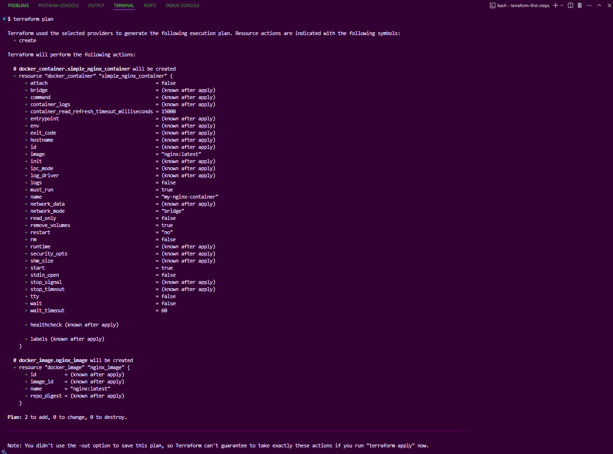

**Was passiert**: `terraform plan` zeigt eine Vorschau der geplanten Infrastruktur-Änderungen an.

### Phase 2: Deployment mit Default-Werten

#### 2.1 Terraform Apply mit Default-Werten - Plan

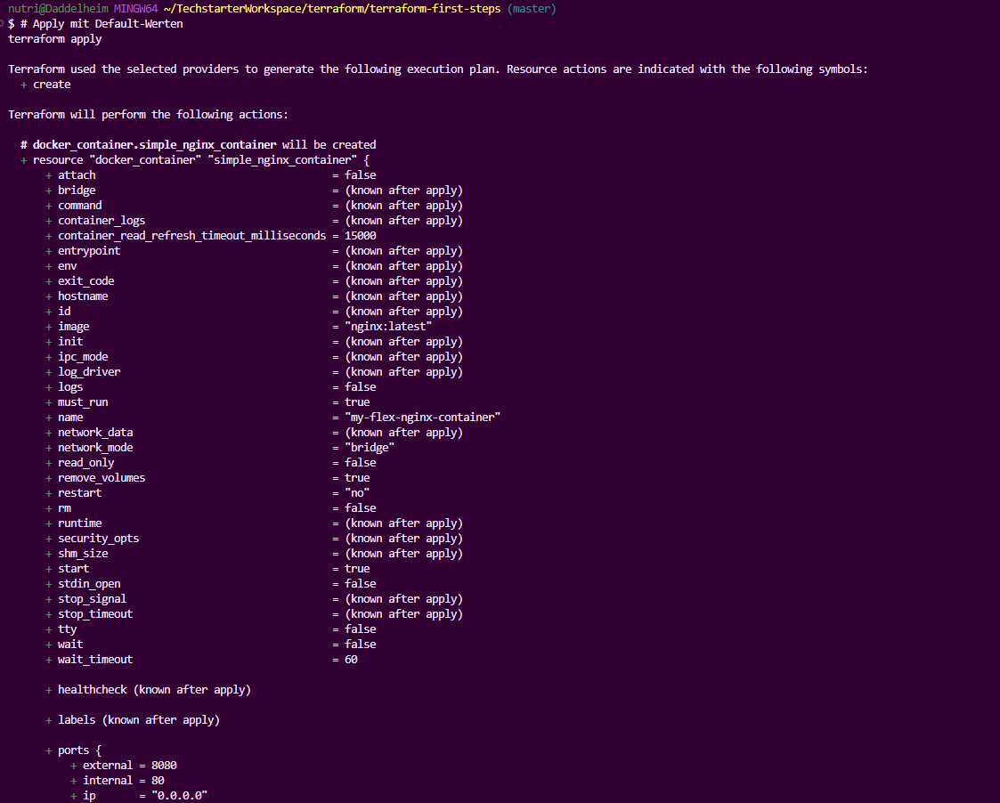

#### 2.2 Terraform Apply mit Default-Werten - Ausführung

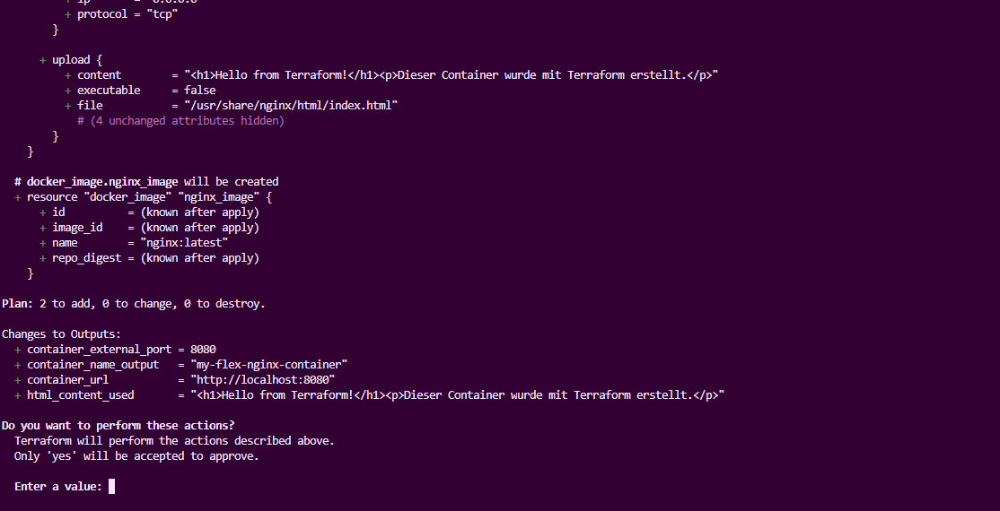

#### 2.3 Terraform Apply mit Default-Werten - Outputs

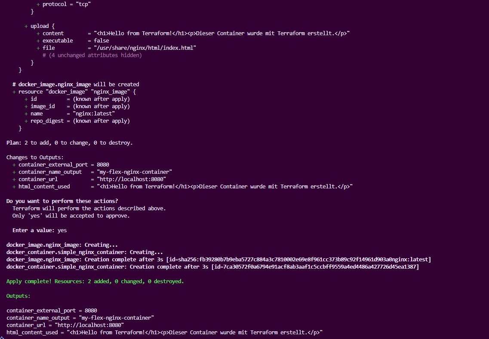

**Was passiert**: Container wird mit Default-Werten erstellt:

- Container-Name: `my-flex-nginx-container`
- Port: `8080`
- HTML-Inhalt: Standard-Willkommensnachricht

#### 2.4 Browser Test - Default Content

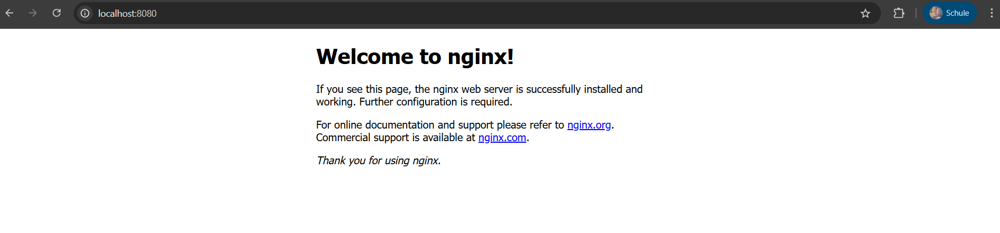

**Verifikation**: Der Container läuft erfolgreich auf `http://localhost:8080` mit dem Standard-HTML-Inhalt.

### Phase 3: Variablen-basierte Konfiguration

#### 3.1 Plan mit .tfvars Datei - Teil 1

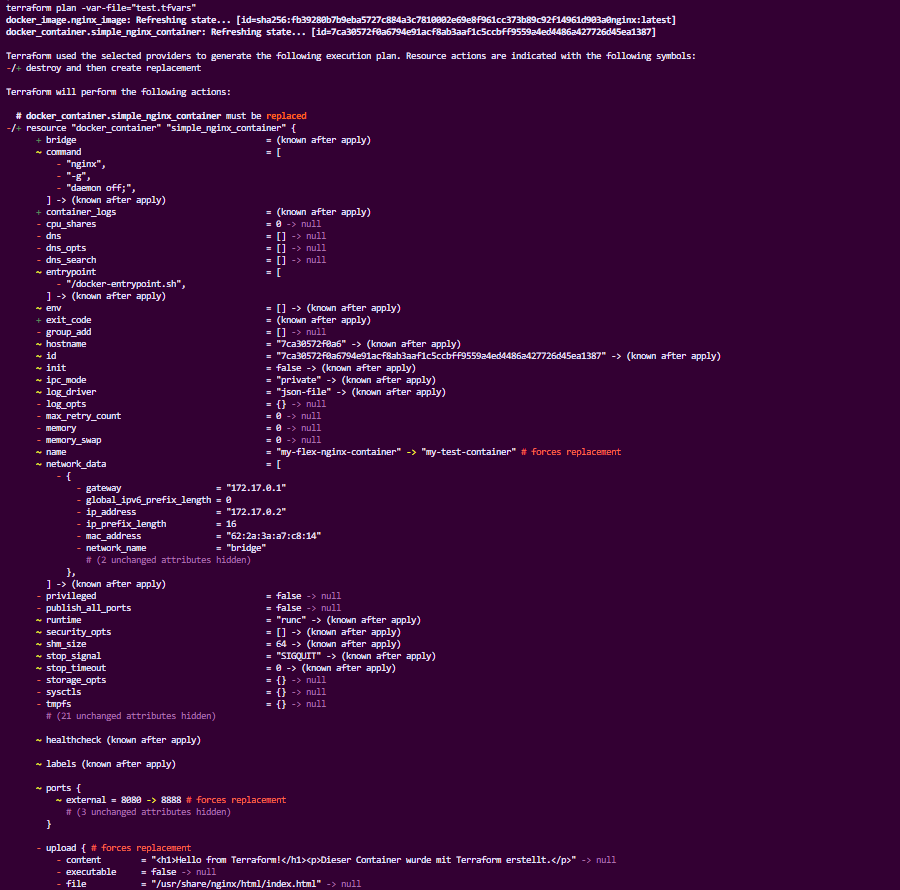

#### 3.2 Plan mit .tfvars Datei - Teil 2

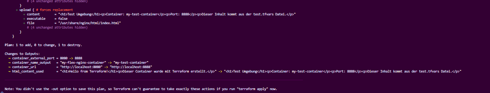

**Was passiert**: `terraform plan -var-file="test.tfvars"` zeigt die geplanten Änderungen basierend auf den Werten aus der tfvars-Datei.

#### 3.3 Browser Test - tfvars Content

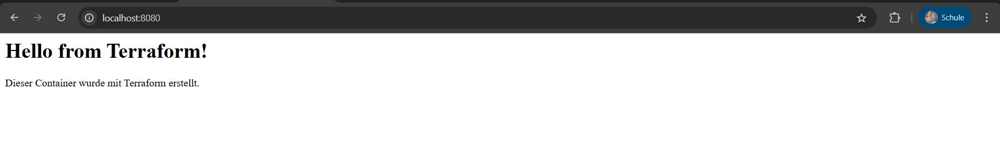

**Verifikation**: Container läuft auf `http://localhost:8888` mit angepasstem HTML-Inhalt aus der tfvars-Datei.

### Phase 4: CLI-Variablen Demonstration

#### 4.1 Apply mit CLI-Variablen - Plan

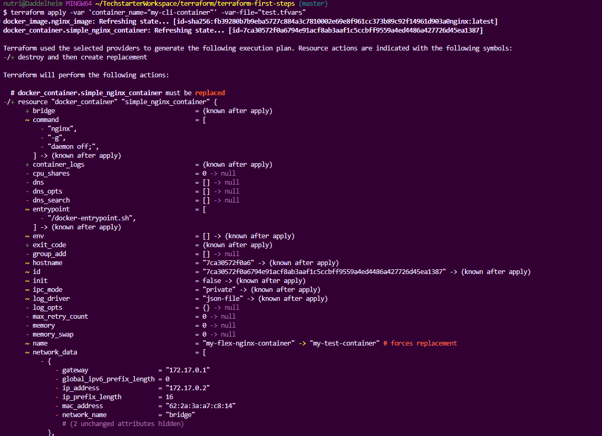

#### 4.2 Apply mit CLI-Variablen - Ausführung

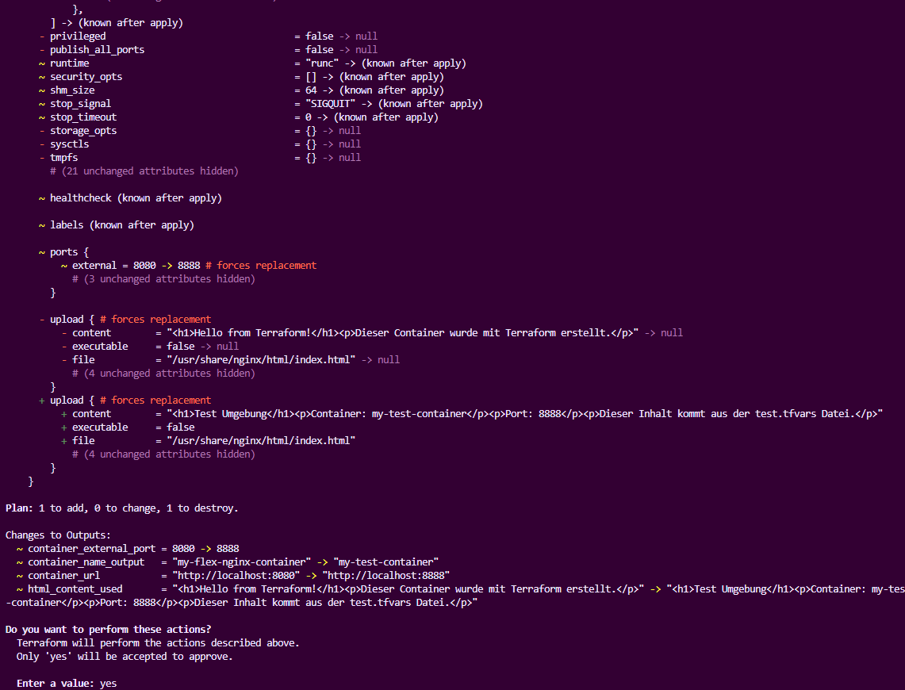

#### 4.3 Apply mit CLI-Variablen - Outputs

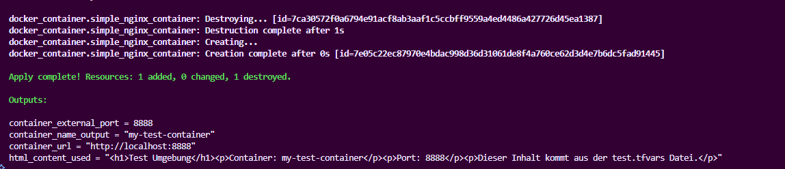

**Was passiert**: `terraform apply -var 'container_name="my-cli-container"' -var-file="test.tfvars"` demonstriert Variable-Priorität:

- CLI-Variable überschreibt Container-Namen
- tfvars-Werte werden für andere Variablen verwendet

### Phase 5: Outputs und State Management

#### 5.1 Terraform Outputs anzeigen

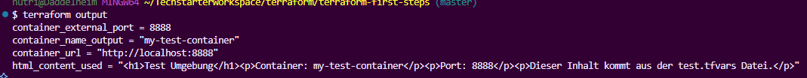

**Was passiert**: `terraform output` zeigt alle konfigurierten Output-Werte nach dem Deployment an.

### Phase 6: Infrastructure Cleanup

#### 6.1 Terraform Destroy

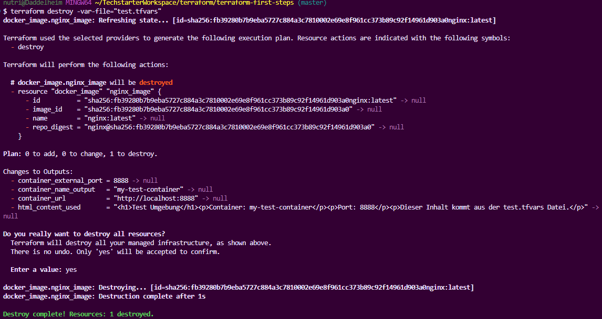

**Was passiert**: `terraform destroy` entfernt alle verwalteten Ressourcen und bereinigt die Infrastruktur.

## Aufgabenübersicht und Lernziele

### Konfigurationselemente

#### Provider-Konfiguration (provider.tf)

- Docker Provider mit spezifischer Version
- Windows-kompatible Konfiguration für Docker Desktop

#### Ressourcen-Management (main.tf)

- Docker Image: `nginx:latest`
- Docker Container mit konfigurierbaren Eigenschaften
- Port-Mapping zwischen Host und Container
- HTML-Content-Upload über Terraform

#### Variable-System (variables.tf)

- `container_name`: Flexibler Container-Name
- `external_port`: Konfigurierbarer Host-Port mit Validation
- `nginx_html_content`: Anpassbarer HTML-Inhalt

#### Output-System (outputs.tf)

- Container-Informationen
- Zugriffs-URL
- Verwendete Konfigurationswerte

### Best Practices Demonstriert

1. **Modulare Dateienstruktur**: Getrennte Dateien für verschiedene Zwecke
2. **Variable Validation**: Eingabewerte-Überprüfung für kritische Parameter
3. **Multiple Variable Sources**: Default-Werte, .tfvars, CLI-Parameter
4. **State Management**: Automatische State-Verwaltung und Backup
5. **Infrastructure as Code**: Versionierbare, wiederverwendbare Konfiguration

## Lernziele erreicht

✅ **Terraform Workflow**: Init, Plan, Apply, Destroy erfolgreich durchgeführt  
✅ **Variable Management**: Flexible Konfiguration mit mehreren Input-Methoden  
✅ **Output System**: Strukturierte Informationsextraktion  
✅ **Provider Integration**: Docker Provider erfolgreich konfiguriert  
✅ **Resource Management**: Container und Image-Verwaltung  
✅ **State Understanding**: Terraform State-Konzepte verstanden  
✅ **Best Practices**: Saubere Code-Organisation und Dokumentation

## Reflexion und Erkenntnisse

### Was hat der Befehl terraform apply getan, als du ihn zum ersten Mal mit deiner initialen Konfiguration (ohne Variablen) ausgeführt hast?

`terraform apply` hat beim ersten Ausführen folgende Aktionen durchgeführt:

1. **Plan-Erstellung**: Terraform hat automatisch einen Execution Plan erstellt und angezeigt
2. **Ressourcen-Erstellung**:
   - Docker Image `nginx:latest` wurde heruntergeladen
   - Docker Container wurde mit dem Namen aus der Konfiguration erstellt
   - Port-Mapping zwischen Host (8080) und Container (80) wurde eingerichtet
3. **State-Erstellung**: Eine neue `terraform.tfstate` Datei wurde erstellt, um den aktuellen Zustand der Infrastruktur zu verfolgen
4. **Outputs-Anzeige**: Die definierten Output-Werte wurden nach erfolgreicher Erstellung angezeigt

### Was ist mit dem Terraform State (terraform.tfstate) passiert, nachdem du terraform apply und terraform destroy ausgeführt hast?

**Nach terraform apply**:

- Die `terraform.tfstate` Datei wurde erstellt/aktualisiert
- Sie enthielt den vollständigen Zustand aller verwalteten Ressourcen (Docker Image und Container)
- Backup-Datei (`terraform.tfstate.backup`) wurde bei Änderungen erstellt
- State beinhaltete Ressourcen-IDs, Attribute und Metadaten

**Nach terraform destroy**:

- Die `terraform.tfstate` Datei wurde geleert (nur noch Metadaten, keine Ressourcen)
- Resources-Array wurde leer: `"resources": []`
- Serial-Nummer wurde erhöht (zeigt Änderungshistorie)
- Backup-Datei behält den letzten Zustand vor destroy

### Wie haben die Variablen (variable {}, var.) deine Konfiguration flexibler und wiederverwendbarer gemacht, verglichen mit der initialen Konfiguration (ohne Variablen)?

**Flexibilität durch Variablen**:

1. **Wiederverwendbarkeit**: Dieselbe Konfiguration kann für verschiedene Umgebungen verwendet werden
2. **Anpassbarkeit**: Container-Name, Port und HTML-Inhalt können ohne Code-Änderungen angepasst werden
3. **Validation**: Port-Validation verhindert ungültige Konfigurationen
4. **Default-Werte**: Sinnvolle Standards für schnelle Deployments
5. **Umgebungs-spezifisch**: Verschiedene .tfvars Dateien für dev/test/prod

**Vorher**: Hardcodierte Werte, Code-Änderungen für jede Anpassung erforderlich  
**Nachher**: Konfigurierbare Parameter, Code bleibt unverändert

### Auf welche drei Arten hast du Werte an deine Input Variablen übergeben? Beschreibe kurz die Methode und ihre Priorität.

**1. Default-Werte (Niedrigste Priorität)**

- **Methode**: Definiert in `variables.tf` mit `default = "wert"`
- **Verwendung**: `terraform apply` (ohne weitere Parameter)
- **Priorität**: Wird überschrieben von allen anderen Methoden

**2. .tfvars Dateien (Mittlere Priorität)**

- **Methode**: Werte in `test.tfvars` definiert, mit `-var-file` Parameter übergeben
- **Verwendung**: `terraform apply -var-file="test.tfvars"`
- **Priorität**: Überschreibt Defaults, wird von CLI-Variablen überschrieben

**3. CLI-Variablen (Höchste Priorität)**

- **Methode**: Direkte Parameterübergabe über `-var` Flag
- **Verwendung**: `terraform apply -var 'container_name="my-cli-container"'`
- **Priorität**: Überschreibt alle anderen Quellen

### Was zeigen die Outputs (output {}, terraform output) an, nachdem du apply ausgeführt hast? Wofür sind sie nützlich?

**Angezeigte Informationen**:

- `container_name_output`: Tatsächlicher Name des erstellten Containers
- `container_external_port`: Verwendeter Host-Port
- `container_url`: Fertige URL zum Zugriff auf den Service
- `html_content_used`: Verwendeter HTML-Inhalt

**Nützlichkeit von Outputs**:

1. **Service Discovery**: Andere Systeme können Output-Werte verwenden
2. **Automatisierung**: Scripts können Output-Werte weiterverarbeiten
3. **Debugging**: Überprüfung der tatsächlich verwendeten Werte
4. **Integration**: Outputs können als Inputs für andere Terraform-Module dienen
5. **Dokumentation**: Zeigt wichtige Informationen über die erstellte Infrastruktur

### Wie hast du den Inhalt der Variable nginx_html_content in die index.html Datei im laufenden Docker Container bekommen? Welche Terraform-Funktion wurde dafür genutzt?

**Verwendete Methode**: `upload` Block in der `docker_container` Ressource

```hcl
upload {
  content = var.nginx_html_content
  file    = "/usr/share/nginx/html/index.html"
}
```

**Funktionsweise**:

- Der `upload` Block ist eine spezielle Funktion des Docker Providers
- Er kopiert Inhalte während der Container-Erstellung in das Container-Dateisystem
- Die Variable `nginx_html_content` wird direkt als `content` übergeben
- Der Zielpath `/usr/share/nginx/html/index.html` überschreibt die Standard-Nginx-Seite

**Alternative Methoden** (nicht verwendet, aber möglich):

- `local-exec` Provisioner mit `docker exec` Befehlen
- Volume-Mounts mit externen Dateien
- Docker Image mit vorinstallierten Inhalten erstellen

**Vorteil der upload-Methode**:

- Integriert in Terraform-Lifecycle
- Keine externen Abhängigkeiten
- Funktioniert zuverlässig während der Container-Erstellung

## Fazit

Dieses Projekt demonstriert erfolgreich den vollständigen Terraform-Workflow und zeigt, wie Infrastructure as Code Best Practices die Flexibilität, Wiederverwendbarkeit und Wartbarkeit von Infrastruktur-Deployments verbessern. Die Verwendung von Variablen, Outputs und strukturierten Konfigurationen ermöglicht es, dieselbe Codebasis für verschiedene Umgebungen und Anforderungen zu nutzen.
