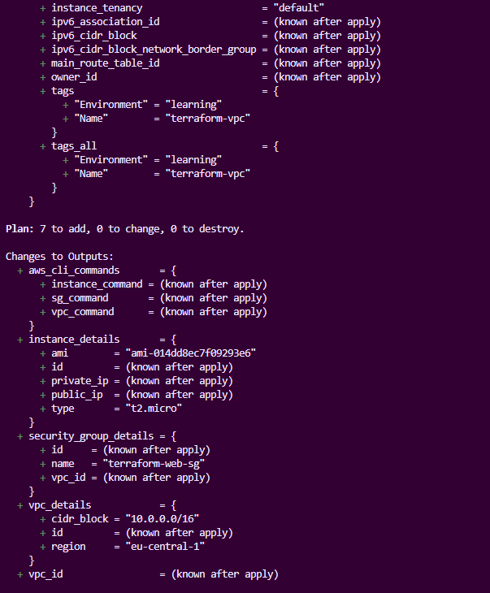
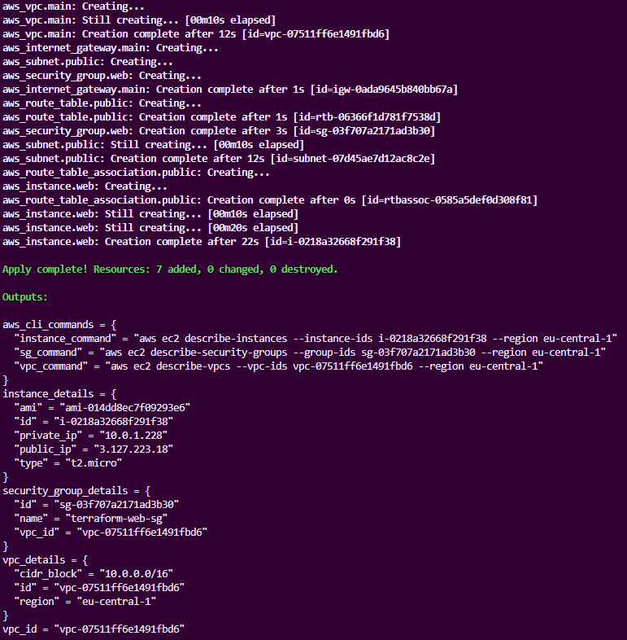
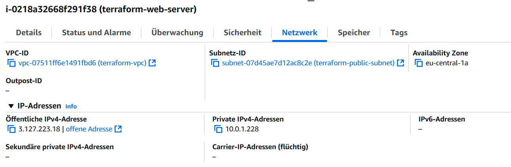
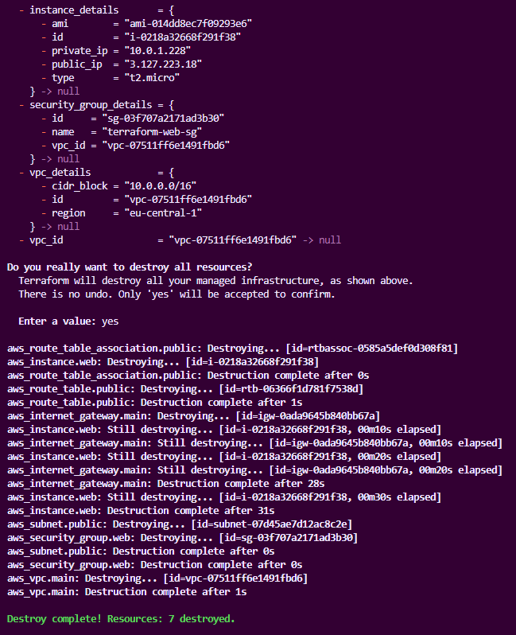

# Terraform AWS VPC mit EC2-Instanz

Dieses Projekt demonstriert die Erstellung einer AWS-Infrastruktur mit mehreren voneinander abhängigen Ressourcen mithilfe von Terraform.

## Projektübersicht

Das Projekt erstellt eine vollständige AWS-Netzwerkinfrastruktur mit:
- Virtual Private Cloud (VPC)
- Internet Gateway
- Öffentliches Subnetz
- Route Table und Assoziationen
- Sicherheitsgruppe mit SSH-Zugriff
- EC2-Instanz

## Architektur

```
Internet
    |
Internet Gateway
    |
Route Table ── Public Subnet (10.0.1.0/24)
    |              |
    |          EC2 Instance
    |              |
VPC (10.0.0.0/16) Security Group (SSH Port 22)
```

## Projektstruktur

```
aws-vpc-ec2/
├── provider.tf          # Terraform & AWS Provider Konfiguration
├── main.tf             # Hauptressourcen (VPC, Subnet, SG, EC2)
├── outputs.tf          # Output-Werte
├── terraform.tfstate   # Terraform State (wird automatisch erstellt)
└── README.md          # Diese Dokumentation
```

## Schnellstart

### Voraussetzungen

1. **Terraform installiert** (>= 1.0)
   ```bash
   terraform version
   ```

2. **AWS CLI konfiguriert**
   ```bash
   aws configure
   # Eingabe: Access Key, Secret Key, Region (eu-central-1), Output (json)
   ```

3. **Git Bash Aliases (optional)**
   ```bash
   # .bashrc erstellen mit Terraform-Aliases
   cat > ~/.bashrc << 'EOF'
   alias tf='terraform'
   alias tfi='terraform init'
   alias tfp='terraform plan'
   alias tfa='terraform apply'
   alias tfd='terraform destroy'
   EOF
   source ~/.bashrc
   ```

### Deployment

1. **Repository klonen und navigieren**
   ```bash
   cd ~/TechstarterWorkspace/terraform/terraform-first-steps/aws-vpc-ec2
   ```

2. **Terraform initialisieren**
   ```bash
   terraform init
   ```

3. **Infrastruktur planen**
   ```bash
   terraform plan
   ```

4. **Infrastruktur erstellen**
   ```bash
   terraform apply
   # Eingabe: yes
   ```

5. **Ressourcen überprüfen**
   ```bash
   terraform output
   ```

## Terraform Outputs

Nach erfolgreichem `terraform apply` erhalten Sie:

```bash
instance_details = {
  "ami" = "ami-xxxxxxxxx"
  "id" = "i-xxxxxxxxx"
  "private_ip" = "10.0.1.x"
  "public_ip" = "x.x.x.x"
  "type" = "t2.micro"
}
security_group_details = {
  "id" = "sg-xxxxxxxxx"
  "name" = "terraform-web-sg"
  "vpc_id" = "vpc-xxxxxxxxx"
}
vpc_details = {
  "cidr_block" = "10.0.0.0/16"
  "id" = "vpc-xxxxxxxxx"
  "region" = "eu-central-1"
}
```

## Ressourcen überprüfen

### Mit Terraform
```bash
# Alle verwalteten Ressourcen auflisten
terraform state list

# Details einer spezifischen Ressource
terraform state show aws_instance.web
terraform state show aws_vpc.main

# Vollständige Infrastruktur anzeigen
terraform show
```

### Mit AWS CLI
```bash
# EC2-Instanz Details
aws ec2 describe-instances --instance-ids INSTANCE_ID --region eu-central-1

# VPC Details
aws ec2 describe-vpcs --vpc-ids VPC_ID --region eu-central-1

# Security Group Details
aws ec2 describe-security-groups --group-ids SG_ID --region eu-central-1
```

### AWS Management Console
1. Region auf **Europe (Frankfurt) eu-central-1** setzen
2. **EC2 Dashboard** → Instances → "terraform-web-server"
3. **VPC Dashboard** → Your VPCs → "terraform-vpc"
4. **EC2 Dashboard** → Security Groups → "terraform-web-sg"

## Cleanup

```bash
# Infrastruktur zerstören
terraform destroy
# Eingabe: yes

# Bestätigung
terraform state list
# (sollte leer sein)
```

## 📸 Screenshots

### Terraform Apply Output

*Initialisiert das Projekt*


*Terraform erstellt 7 Ressourcen in der korrekten Reihenfolge*

### AWS EC2 Dashboard

*EC2-Instanz im AWS Dashboard (Region: eu-central-1)*

### AWS VPC Dashboard

*Erstellte VPC mit konfiguriertem CIDR-Block*

### Security Group Rules

*Sicherheitsgruppe mit SSH-Regel (Port 22)*

### Terraform State

*Terraform Destroy Output*


## Lernziele erreicht

✅ Mehrere abhängige AWS-Ressourcen definiert  
✅ Implizite Dependencies durch Ressourcen-Referenzen  
✅ Sicherheitsgruppe mit SSH-Zugriff konfiguriert  
✅ Vollständiger Terraform-Workflow ausgeführt  
✅ Outputs verstanden und angewendet  
✅ Ressourcen in AWS Console überprüft  

---

## Antworten auf die Aufgabenstellung

### Welche AWS-Ressourcen (Typen) hast du in dieser Aufgabe mit Terraform erstellt?

In dieser Aufgabe wurden **7 AWS-Ressourcen** mit folgenden Terraform-Ressourcentypen erstellt:

1. **`aws_vpc`** - Virtual Private Cloud mit CIDR 10.0.0.0/16
2. **`aws_internet_gateway`** - Internet Gateway für Internetzugang
3. **`aws_subnet`** - Öffentliches Subnetz mit CIDR 10.0.1.0/24
4. **`aws_route_table`** - Route Table für Routing zum Internet Gateway
5. **`aws_route_table_association`** - Verknüpfung zwischen Subnetz und Route Table
6. **`aws_security_group`** - Sicherheitsgruppe mit SSH-Regel (Port 22)
7. **`aws_instance`** - EC2-Instanz (t2.micro) mit Amazon Linux

Zusätzlich wurde eine **Data Source** (`data "aws_ami"`) verwendet, um automatisch die neueste Amazon Linux AMI zu finden.

### Beschreibe, wie du die Abhängigkeiten zwischen den Ressourcen definiert hast. Waren es implizite oder explizite Abhängigkeiten?

Die Abhängigkeiten wurden ausschließlich **implizit** durch **Ressourcen-Referenzen** definiert:

**Implizite Dependencies durch Attribut-Referenzen:**
- `aws_internet_gateway.main.vpc_id = aws_vpc.main.id` → IGW hängt von VPC ab
- `aws_subnet.public.vpc_id = aws_vpc.main.id` → Subnet hängt von VPC ab
- `aws_route_table.public.vpc_id = aws_vpc.main.id` → Route Table hängt von VPC ab
- `gateway_id = aws_internet_gateway.main.id` → Route hängt von IGW ab
- `subnet_id = aws_subnet.public.id` → Association hängt von Subnet ab
- `vpc_id = aws_vpc.main.id` → Security Group hängt von VPC ab
- `subnet_id = aws_subnet.public.id` → EC2 hängt von Subnet ab
- `vpc_security_group_ids = [aws_security_group.web.id]` → EC2 hängt von SG ab

**Resultierende Erstellungsreihenfolge:**
1. VPC → 2. Internet Gateway, Subnet, Security Group → 3. Route Table → 4. Route Table Association, EC2 Instance

**Keine expliziten Dependencies** (`depends_on`) waren nötig, da Terraform die Abhängigkeiten automatisch aus den Ressourcen-Referenzen ableitet.

### Was ist die Rolle der Sicherheitsgruppe in diesem Setup? Warum ist es wichtig, die SSH-Regel darin zu konfigurieren?

**Rolle der Sicherheitsgruppe:**
Die Sicherheitsgruppe fungiert als **virtuelle Firewall** auf Instance-Ebene und kontrolliert den ein- und ausgehenden Netzwerkverkehr zur EC2-Instanz.

**Konfigurierte Regeln:**
```hcl
# Eingehender SSH-Traffic (Port 22)
ingress {
  from_port   = 22
  to_port     = 22
  protocol    = "tcp"
  cidr_blocks = ["0.0.0.0/0"]  # Von überall (Übungszwecke)
}

# Ausgehender Traffic (alle Ports)
egress {
  from_port   = 0
  to_port     = 0
  protocol    = "-1"           # Alle Protokolle
  cidr_blocks = ["0.0.0.0/0"]  # Zu überall
}
```

**Wichtigkeit der SSH-Regel:**
- **Fernzugriff ermöglichen:** Ohne SSH-Regel (Port 22) wäre keine Verbindung zur EC2-Instanz möglich
- **Sicherheitskonzept:** Standardmäßig blockiert AWS allen eingehenden Traffic
- **Explizite Erlaubnis:** Nur explizit erlaubte Ports/Protokolle werden durchgelassen
- **Produktionshinweis:** In der Produktion sollte `0.0.0.0/0` durch spezifische IP-Bereiche ersetzt werden

### Vergleiche den Output von terraform plan und terraform apply mit der S3-Bucket-Aufgabe. Was war der Hauptunterschied?

**Hauptunterschiede:**

| Aspekt | S3-Bucket Aufgabe | VPC-EC2 Aufgabe |
|--------|------------------|-----------------|
| **Anzahl Ressourcen** | 1 Ressource | 7 Ressourcen |
| **Abhängigkeiten** | Keine | Komplexe Abhängigkeitskette |
| **Erstellungsreihenfolge** | Einzelne Ressource | Sequenzielle Erstellung basierend auf Dependencies |
| **Plan-Komplexität** | Einfach: `1 to add` | Komplex: `7 to add` mit Abhängigkeitsbaum |
| **Apply-Dauer** | ~5-10 Sekunden | ~30-60 Sekunden |
| **Fehlerrisiko** | Gering | Höher (AMI-IDs, Regionen, AZ-Verfügbarkeit) |

**Terraform Plan Output Unterschiede:**
- **S3:** Zeigt 1 Resource als `+` (to be created)
- **VPC-EC2:** Zeigt 7 Resources als `+` mit sichtbarer Abhängigkeitsreihenfolge

**Terraform Apply Output Unterschiede:**
- **S3:** Direkte Erstellung in einem Schritt
- **VPC-EC2:** Stufenweise Erstellung (VPC → IGW/Subnet/SG → Route Table → Association/EC2)

**Praktische Auswirkungen:**
- Komplexere Infrastruktur erfordert mehr Planung und Verständnis der AWS-Services
- Fehlerbehandlung wird wichtiger (z.B. falsche AMI-IDs, Region-Mismatches)
- Rollback-Szenarien werden komplexer bei Fehlern

### Was passiert mit der Datei terraform.tfstate nach einem erfolgreichen terraform apply und nach einem erfolgreichen terraform destroy?

**Nach `terraform apply`:**

Die `terraform.tfstate` Datei wird **erstellt/aktualisiert** und enthält:
- **Vollständige Ressourcen-Details:** IDs, ARNs, IP-Adressen, etc.
- **Metadaten:** Terraform-Version, Provider-Versionen
- **Dependency-Graph:** Implizite Abhängigkeiten zwischen Ressourcen
- **Attribut-Werte:** Sowohl konfigurierte als auch von AWS zugewiesene Werte

```json
{
  "version": 4,
  "terraform_version": "1.x.x",
  "resources": [
    {
      "type": "aws_vpc",
      "name": "main",
      "instances": [{
        "attributes": {
          "id": "vpc-xxxxxxxxx",
          "cidr_block": "10.0.0.0/16",
          "arn": "arn:aws:ec2:eu-central-1:123456789012:vpc/vpc-xxxxxxxxx"
        }
      }]
    }
  ]
}
```

**Nach `terraform destroy`:**

Die `terraform.tfstate` Datei wird **geleert** aber **nicht gelöscht**:
- **Leere Ressourcenliste:** `"resources": []`
- **Metadata bleibt:** Terraform- und Provider-Versionen bleiben erhalten
- **Backup erstellt:** Vorherige State wird als `.backup` gespeichert

```json
{
  "version": 4,
  "terraform_version": "1.x.x",
  "resources": []
}
```

**Wichtige State-Management Punkte:**
- **Backup-Dateien:** `terraform.tfstate.backup` wird bei jeder Änderung erstellt
- **Locking:** Verhindert parallele Terraform-Operationen
- **Remote State:** In der Produktion sollte State remote gespeichert werden (S3 + DynamoDB)
- **Sensible Daten:** State kann sensible Informationen enthalten → Sicher aufbewahren

**State-Operationen:**
```bash
# State anzeigen
terraform show

# State-Liste
terraform state list

# State-Details einer Ressource
terraform state show aws_instance.web

# State-Refresh (ohne apply)
terraform refresh
```

---

## Fazit

Diese Aufgabe demonstrierte erfolgreich:
- Komplexe AWS-Infrastruktur mit Terraform
- Implizite Dependency-Management
- Praktische Anwendung von Terraform-Workflows
- Integration zwischen verschiedenen AWS-Services
- State-Management bei komplexeren Infrastrukturen

Die Erfahrung zeigt, wie Terraform bei größeren Infrastrukturen an Wert gewinnt, da es Dependencies automatisch verwaltet und eine konsistente, wiederholbare Infrastruktur-Bereitstellung ermöglicht.